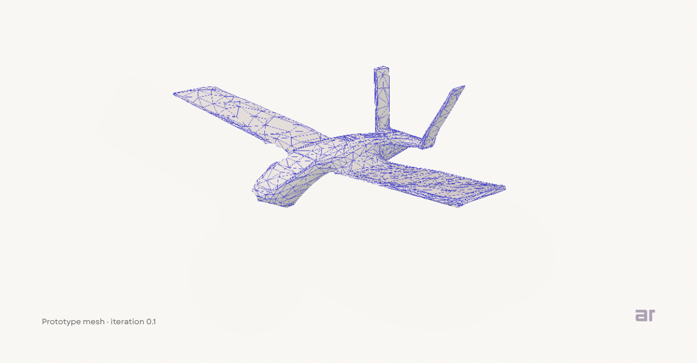

# Atul Raj

Builder focused on engineering systems, iterative design, and early-stage R&D.

## Current Work

I’m currently working on exploratory R&D in aerospace systems, with a focus on
structural design, modular thinking, and iterative digital prototyping.

Below is an **early digital prototype mesh (iteration 0.1)** from ongoing work.  
Details are intentionally limited at this stage.

## Philosophy

- Build before announcing  
- Iterate before optimizing  
- Show progress, not promises  

## Notes

This profile documents work-in-progress explorations.  
Public content is shared selectively and at a high level.
