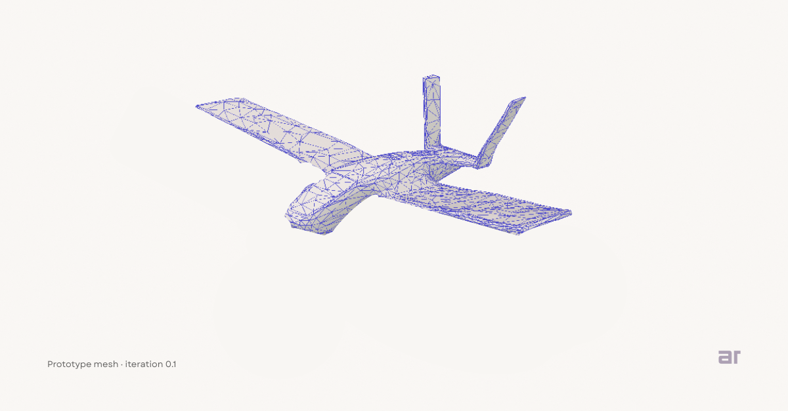

# Atul Raj

Hey fellow humans, I’m Atul Raj, a founder working at the intersection of orbital infrastructure, systems engineering, and long-horizon technology development.

My primary focus is Graviron Aerospace, where I am building reusable orbital systems designed for disciplined, repeatable operations in Earth orbit. Graviron is centered on autonomous orbital navigation, controlled in-orbit interaction, and reusable atmospheric return, developed through incremental validation across ground, atmospheric, and glide-based testing. This is the core problem space I am committed to solving long term.

Alongside Graviron, I founded NexCorp, a digital infrastructure company that builds structured, scalable systems for startups and operators. NexCorp functions as an operational and strategic platform I own, focused on high-leverage digital systems and infrastructure design, while Graviron remains my primary technical and time-intensive pursuit.

My broader interest lies in how humanity builds resilient infrastructure, both on Earth and in orbit. I’m drawn to systems that are reusable, durable, and engineered with long-term consequences in mind.

I actively seek conversations with engineers, researchers, and builders who care about serious space infrastructure, orbital sustainability, and disciplined execution over hype.

## Current Work

I’m currently working on exploratory R&D in aerospace systems, with a focus on
structural design, modular thinking, and iterative digital prototyping.

Below is an **early digital prototype mesh (iteration 0.1)** from ongoing work.  
Details are intentionally limited at this stage.

## Philosophy

- Build before announcing  
- Iterate before optimizing  
- Show progress, not promises  

## Notes

This profile documents work-in-progress explorations.  
Public content is shared selectively and at a high level.
